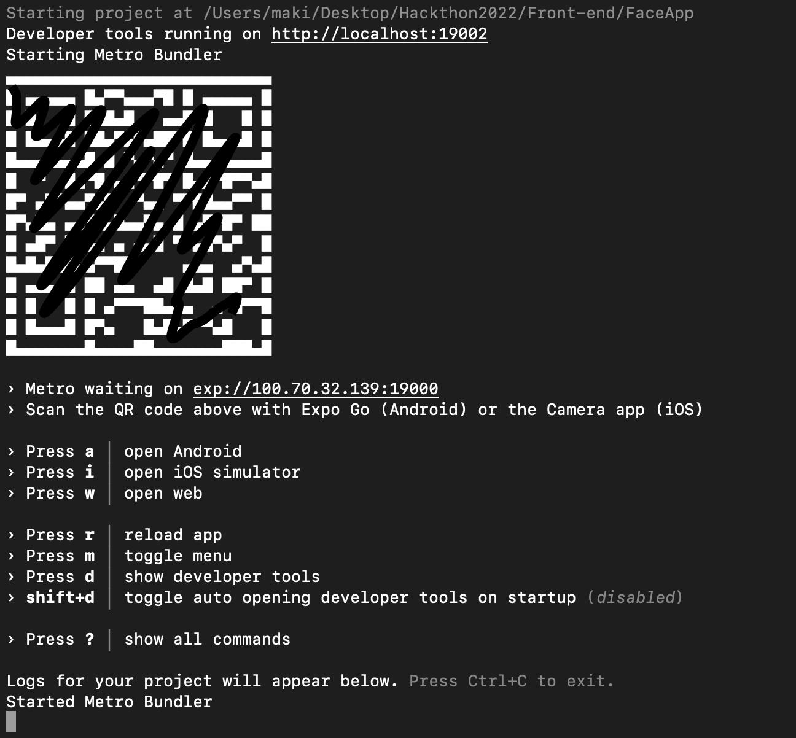

# Front-end
## フロントエンド用リポジトリ

React Nativeのビルドや開発を支援してくれるサービスである*Expo*を使います.  
前提： Node.jsとnpm が使える状態である. 

`npm install -g expo-cli`

これだけでインストールできます.  

テストしたいときは 
`expo start` で開発サーバーを起動. 
下記の画像の状態で`i`か`a`を押すとそれぞれiOS，Androidのエミュレータ/実機でアプリをスタートさせることができます. 

Androidのエミュレータ環境を作るのはなかなかに面倒なので，Androidに関しては私のMacか，Android実機でやる予定です．
iOSのテストははXcodeが入っていればできると思います．

Expo Go というアプリをスマホにダウンロードしている場合，同じWiFiに接続している場合のみQRコードを読み込むだけでデバッグができます.  

